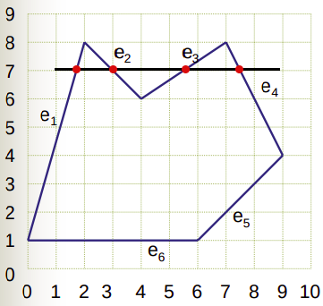
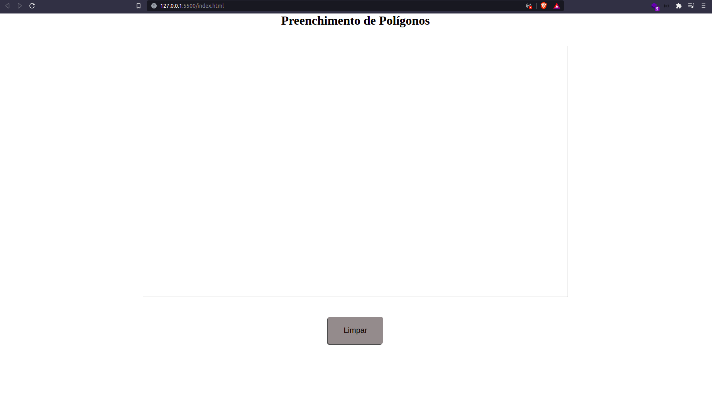
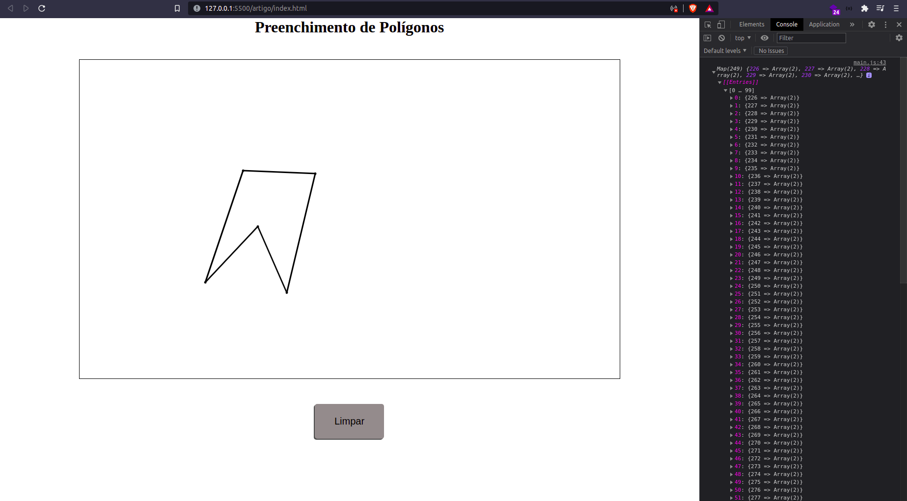
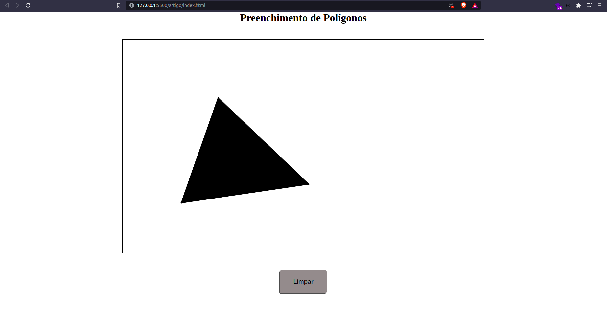
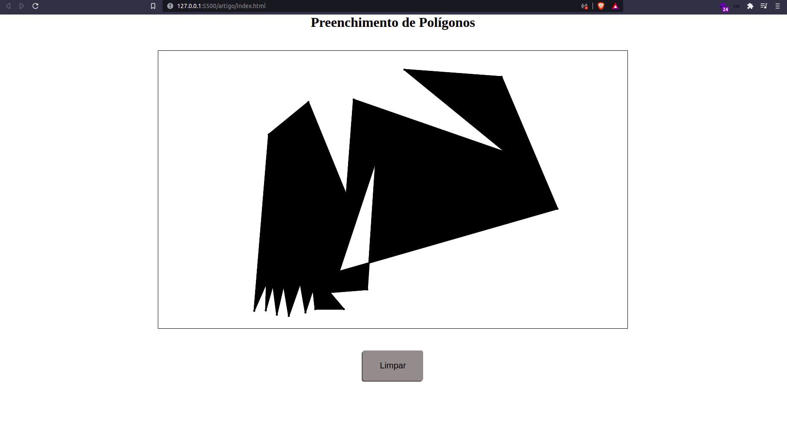

# Preenchimento de Polígonos

Por definição, um polígono é uma ifura simple, plana e fechada, formada por um conjunto ordenado de três ou mais vértices, dispostos em um plano de tal modo que a junção de seus vértices formam segmentos de reta que não se cruzam, tal como mostrado na figura abaixo:

<div style="background-color: white; justify-content: space-around;  display: flex">
  
  
</div>

Um polígono pode ser preenchido, ou não e há diferentes algoritmos para preencher um polígono. Neste artigo implementaremos o algoritmo Scanline.

## Algoritmo ScanLine

O algoritmo foi proposto por Wylie, Romney, Evans e Erdahl no ano de 1967 ([referenciar](./ScanLine.pdf), [referenciar](https://webpages.uncc.edu/krs/courses/4120-5120/lectures/hs2.pdf)). A ideia básica desse algoritmo é mapear todos os pontos de interseção, no eixo das abcissas, para um determinado ponto no eixo das ordenadas. Esses pontos são parte das arestas do polígono. Assim, sabendo esses pontos, podemos preencher o espaço entre eles.

Utilizando o polígono da figura 2 como exemplo podemos pensar no seguinte:



imagem disponível [aqui](http://wiki.icmc.usp.br/images/7/7e/Scanline.pdf)

Se no ponto de ordenada 7 traçarmos uma reta que cruza todo o polígono, podemos ver que há quatro arestas que interceptam essa reta, ou seja, para o ponto com Y = 7 temos 4 pontos diferentes em X que marcam os limites do polígono. Se pudermos definir quais são esses pontos, podemos então preencher o espaço que há entre eles (de dois em dois do menor para o maior).

Durante a implementação, as exceções serão explicadas.

## Implementação

Para implementar esse algoritmo, usaremos uma página html simples, que pode ser aberta em seu navegador e a linguagem de programação javascript. Além disso para facilitar a interface com o **_canvas_**, utilizaremos a bibiloteca P5.js (([https://p5js.org/](https://p5js.org/))). Como o foco deste artigo é a implementação do algoritmo ScanLine para preenchimento de polígonos, não entraremos em detalhes sobre a utilização, conceitos e paradigmas do **P5.js**, estruturas **html** ou do **css**. Sabendo disso, vamos iniciar ; ).

### Preparando o ambiente

Crie uma pasta para seu projeto e dentro dela crie um arquivo index.html e um arquivo styles.css, cole os seguintes códigos.

```html
<!-- index.html -->
<!DOCTYPE html>
<html lang="en">
  <head>
    <meta charset="UTF-8" />
    <meta http-equiv="X-UA-Compatible" content="IE=edge" />
    <meta name="viewport" content="width=device-width, initial-scale=1.0" />
    <script src="https://cdn.jsdelivr.net/npm/p5@1.4.0/lib/p5.js"></script>
    <link rel="stylesheet" href="./styles.css" />

    <title>Preenchimento de polígonos</title>
  </head>
  <body>
    <main>
      <h1>Preenchimento de Polígonos</h1>
      <section id="canvas"></section>
      <button onclick="clearCanvas()">Limpar</button>
    </main>
    <script src="./main.js"></script>
  </body>
</html>
```

```css
/*styles.css*/
* {
  margin: 0;
  border: 0;
  padding: 0;
  box-sizing: border-box;
}

body {
  width: 100vw;
}

main {
  display: flex;
  flex-direction: column;
  align-items: center;
}

canvas {
  outline: 1px solid black;
  margin: 3rem 0;
}

button {
  outline: none;
  background-color: #928c8c;
  padding: 1.5rem 2.5rem;
  border-radius: 5px;
  font-size: 20px;

  box-shadow: -2px 2px rgba(0, 0, 0, 0.7);
  transition: 0.2s;

  cursor: pointer;
}

button:hover {
  background-color: #666161;
}
```

Neste código, temos uma estrutura básica de um html com uma seção principal (main), com  um título, uma _section_ para o _canvas_ e um botão para limpar o _canvas_. No código css, há apenas alguns enfeites para que possamos identificar visualmente os componentes e melhor a experiência durante o desenvolvimento.


No final do arquivo html você pode perceber a importação do nosso arquivo javascript e no começo a importação da biblioteca P5.js. Desse modo, crie um arquivo main.js e nele cole o seguinte código:

```js
// main.js
var canvas;

function setup() {
  canvas = createCanvas(1100, 650).parent("canvas");

  fill("#000000");
  stroke("#000000");
  strokeWeight(3);

  canvas.mousePressed(() => {
    const currentVertice = { x: Math.trunc(mouseX), y: Math.trunc(mouseY) };

    setVertice(currentVertice);
  });
}

function setVertice(currentVertice) {
  circle(currentVertice.x, currentVertice.y, 2);
}

function clearCanvas() {
  clear();
}
```

O que fazemos nessas funções iniciais é criar um canvas de 1100 unidades de largura por 650 unidades de altura, delegar as cores das linhas e preenchimento, além do tamanho das linhas. Além disso temos uma fução para que cada click no canvas seja desenhado um ponto onde ocorreu o click - que futuramente será um dos vértices do nosso polígono e uma função para limpar todos os desenhos feitos no _canvas_, que é assionada pelo botão "Limpar". 

Tendo essas condições iniciais feitas, a sua interface deve ter a aparência da **imagem X**, desenhar pontos onde você clicar e removê-los ao clicar no botão "Limpar".



## Estruturas Necessárias

Para que possamos executar o algoritmo de preenchimento devemos ter todos os vértices dopolígono armazenados: sendo eles:

- Todos os vértices;
- O menor e maior Y do polígono;
- A lista de interseções para cada Y do polígono.

Os vértices de um polígon podem ser representados por estruturas que armazenam suas coordenadas x e y.
O menor e o maior vértice do polígono pode ser representado por duas váriáveis que os armazenam.
A lista de interseções pode ser representada por uma lista que tem a coordenada Y como chave (ou cabeça) e um vetor de coordenadas X, que marcam os pontos de interseção. O javascript apresenta a estrutura [Map](https://developer.mozilla.org/en-US/docs/Web/JavaScript/Reference/Global_Objects/Map) para solucionar esse caso.

Assim, sabendo os dados que precisamos armazenar podemos criar um objeto _polygon_, conforme demonstrado abaixo:

```js
const polygon = {
  vertices: [],
  minY: Number.POSITIVE_INFINITY,
  maxY: Number.NEGATIVE_INFINITY,
  intersections: new Map(),
};
```
Este objeto representa um polígono genérico, onde a variável vertices é um vetor que irá armazenar todos os _n_ vértices do polígono, as variáveis minY e maxY irão armazenar o menor e maior Y do polígono, respectivamente e a variável intersection irá armazenar a coordenada Y sendo sua chave e um vetor de coordenadas X.

## Obtendo os Vértices

Os vértices do polígono são definidos com os cliques do usuário, ou seja, a cada clique um novo vértice é adicionado ao polígono. Para isso podemos utilizar a função **_setVertice_** já definida anteriormente. Basta executar o comando push, passando o _currentVertice_ que é recebido como parâmetro. Assim, ao final do polígono teremos todos os vértices adicionados ao vetor, onde cada vertice é composto por _x_ e _y_. 
Para uma melhor experiência é interessante desenhar as arestas enquanto definimos os vértices. Para isso, devemos utilizar a função _line_, ligando os vértices, tal como segue o código:

```js
function setVertice(currentVertice) {
  polygon.vertices.push(currentVertice);

  const lastIndex = polygon.vertices.length - 1;

  circle(currentVertice.x, currentVertice.y, 2);

  if (lastIndex > 0) {
    const lastVertice = polygon.vertices[lastIndex - 1];
    line(lastVertice.x, lastVertice.y, currentVertice.x, currentVertice.y);
  }
}
```

Nesse momento, seu polígono está sendo desenhado com vértices e arestas. Entretanto, temos dois problemas:

1. A variável polygon.vertices não é limpa; 
2. O polígono não fecha;

Começando pelo mais fácil, devemos limpar a variável _polygon.vertices_ toda vez em que o _canvas_ for limpo. Para isso, basta adicionar o código _polygon.vertices = []_.

Para que façamos o polígono fechar, a maneira mais fácil é escolher uma tecla (vamos utilizar a barra de espaço) que quando pressionada o processo de desenhar a aresta entre o último e o primeiro vértice seja feito. Utilizando a função _keyPressed_ do P5 podemos observar quando a barra de espaço foi pressionada:

```js
function keyPressed() {
  if (keyCode === 32) {
    const lastIndex = polygon.vertices.length - 1;
    const vertices = polygon.vertices;

    line(
      vertices[0].x,
      vertices[0].y,
      vertices[lastIndex].x,
      vertices[lastIndex].y,
    );
  }
}
```

Agora seu polígono pode ser completamente definido e fechado. Vale lembrar que a única parte desse código que é essencial para o preenchimento é o armazenamento dos vértices. Os demais processos ocorrem com o objetivo de tornar o processo visual mais agradável e semântico.

## Algoritmo ScanLine

Logo após fecharmos o polígono devemos realizar três passos:

1. Definir os pontos de interseção do polígono;
2. Ordenar e garantir que os pixels encontrados estão dentro do polígono;
3. Definir a menor e maior coordenada y;
4. Preencher o polígono;

### 1. Definindo os pontos de interseção do polígono

Para definir as interseções devemos calcular os todos os pontos _x_ em uma determinada aresta AB. Esses pontos são obtidos através de um método incremental, onde pode-se somar ao _x_ anterior com 1 / _coeficiente_angular_, obtendo-se assim o próximo ponto.
O valor 1 / _coeficiente_angular_ pode ser interpretado como a variação em _x_ para uma unidade variada em _y_.

```js
function defineIntersections() {
  const verticesSize = polygon.vertices.length;

  for (let i = 0; i < verticesSize; i++)
    defineEdge(polygon.vertices[i], polygon.vertices[(i + 1) % verticesSize]);
}
```

A função _defineIntersections_ percorre todos os vértices em sequência, chamando a função _defineEdge_. Nessa função faremos as operações necessárias para obter os valores da interseção nesta aresta.

```js
function defineEdge(vertice1, vertice2) {
  if (vertice1.y != vertice2.y) {
    const intersections = polygon.intersections;
    let initialY, endY;
    let currentX;

    const variation = (vertice2.x - vertice1.x) / (vertice2.y - vertice1.y);

    if (vertice1.y < vertice2.y) {
      initialY = vertice1.y;
      endY = vertice2.y;
      currentX = vertice1.x;
    } else {
      initialY = vertice2.y;
      endY = vertice1.y;
      currentX = vertice2.x;
    }

    for (let currentY = initialY; currentY < endY; currentY++) {
      if (!intersections.get(currentY)) intersections.set(currentY, [currentX]);
      else intersections.get(currentY).push(currentX);
      currentX += variation;
    }
  }
}
```

Só é necessário descobrir os pontos de interseção de uma aresta se a mesma não for horizontal. Assim, precisamos definir o ponto _Y_ inicial para o laço de repetição, a variação em _X_ para cada _Y_ percorrido e o ponto _Y_ de parada do laço.

A variação pode ser descoberta pelo inverso do coeficinete angular da reta, ou seja, por (ponto2.x - ponto1.x) / (ponto2.y - ponto1.y). Além disso, sempre percorremos a aresta do ponto com menor _Y_ para o ponto com maior _Y_. 

Ao percorrer a aresta devemos apenas verificar se já exite uma chave armazenada com o _Y_ da iteração. Caso não exista, devemos criá-la e iniciar o vetor de pontos _X_. Caso já exista, basta adicionar o ponto ao final do vetor daquela chave.

Após definir todos os pontos de interseção do polígono, você pode adicionar _console.log(polygon.intersections)_ ao final da função _defineIntersections_, ir até seu navegador e abrir as ferramentas de desenvolvedor (Figura X). Ao desenhar um polígono, ele mostrará todas as chaves com seus respectivos vetores com os _X_ que são interseções daquele determinado ponto _Y_ (Figura X);




### 2. Ordenar e garantir que os pixels encontrados estão dentro do polígono;

Como você pode ter percebido no log que fizemos, alguns vetores estão desordenados, entertanto, para preenchermos o polígono eles devem estar preenchidos. Para isso, adicionamos o seguinte código ao final da função _defineIntersections_:

```js
polygon.intersections.forEach((xArray) => xArray.sort((a, b) => a - b));
```

Esse código percorre todas as listas e ordena os vetores dessas do menor para o maior valor.

Ao calcularmos os pontos de interseção, eles estão exatamente encima da aresta, entretanto, devemos preencher apenas o interior do polígono. Assim, para garantirmos que todos os pontos estão dentro do polígono, devemos aproximar as coordenadas _X_ à um valor inteiro. 
Entretanto, não podemos aproximar os os pixels das arestas que estão à esqueda para baixo, pois assim não estariam mais dentro do polígono. O mesmo se aplica às coordenadas das arestas à direita do polígono. Caso essas sejam aproximadas para cima, elas estarão fora do polígono definido.

Felizmente, sabendo que cada lista da nossa variável intersections está ordenada do menor para o maior valor, sabemos que toda posição de índice par (0, 2, 4, ..., 2n) é a pertencente à uma aresta da esquerda do polígono, ou seja, deve ser arredondada para cima. Análogamente, sabemos que todas as posições ímpares (1, 3, 5, ..., 2n-1) é pertencente à uma aresta à direita do polígono, ou seja, devem ser arredondadas para baixo.

Sabendo disso, podemos utilizar a mesma função _forEach_ que utilizamos para ordenar o vetor, para fazer os arredondamentos, evitando assim ter que percorrer todas listas novamente:

```js
polygon.intersections.forEach((xArray) => {
  xArray.sort((a, b) => a - b);

  const arraySize = xArray.length;

  for (let i = 0; i < arraySize; i++) {
    if (i % 2 === 0) xArray[i] = Math.ceil(xArray[i]);
    else xArray[i] = Math.floor(xArray[i]);
  }
});
```

### 3. Definir a menor e maior coordenada y;

É necessário obter esses pontos para utlizá-los posteriormente no preenchimento. A menor e maior coordenada _Y_ está em um dos vértices do polígono, portanto, basta percorrer o vetor de vértices e verificar qual dos pontos possui o maior e menor _Y_, como segue o código que pode ser adicinonado ao final da função _defineIntersections_:

```js
polygon.vertices.forEach((vertice) => {
    if (polygon.maxY < vertice.y) polygon.maxY = vertice.y;
    if (polygon.minY > vertice.y) polygon.minY = vertice.y;
  });
```

Como ao criarmos o objeto polígono as variáveis minY e maxY receberam os valores **POSITIVE_INFINITY** e **NEGATIVE_INFINITY**, respectivamente, na primeira iteração ambas as variáveis recebem o mesmo valor, e com o decorrer das iterações, os valores são encontrados.

### 4. Preencher o polígono

Chegamos aos finalmentes, entretanto, antes de implementarmos o preenchimento, devemos também _resetar_ as variáveis _intersections_, _minY_ e _maxY_ do polígono, para que essas não interfiram em outros polígonos após a limpeza do canvas. Para isso, adicione o seguinte código na função _clearCanvas_:

```js
function clearCanvas() {
  polygon.vertices = [];
  polygon.intersections = new Map();
  polygon.minY = Number.POSITIVE_INFINITY;
  polygon.maxY = Number.NEGATIVE_INFINITY;

  clear();
}
```

Agora com tudo certo e definido podemos efeitvamente preencher o polígono!

O preenchimento do polígono é feito de cima para baixo (do menor para o maior _Y_), onde para cada _Y_, utilizamos o vetor de coordenadas _X_ - armazenados em _intersections_. Vamos pegar as coordenadas _X_ duas a duas nesse vetor, pois essas formam o intervalo de preenchimento entre duas arestas, e preencher com pontos, conforme segue:

```js
function fillPolygon() {
  const initialY = polygon.minY;
  const endY = polygon.maxY;
  const intersections = polygon.intersections;

  for (let currentY = initialY; currentY < endY; currentY++) {
    const currentPoint = intersections.get(currentY);
    let k = 0;

    do {
      let firstX = currentPoint[k];
      let endX = currentPoint[k + 1];

      for (let currentX = firstX; currentX < endX; currentX++)
        point(currentX, currentY);

      k += 2;
    } while (currentPoint[k]);
  }
}
```
Antes de finalizarmos, você deve chamar a função _fillPolygon_ ao final da função _defineIntersections_. Ao fazer isso, os polígonos de qualquer complexidade ou quantidade de lados será preenchido em sua página html:




## Conclusão

Neste artigo foram passados os princípios do algoritmo scanLine e um modo de implementá-lo com javascript. Sabendo esses conceitos, é possível implementá-lo em qualque linguagem com suporte para ferramentas visuais e de desenho.
Entretanto, como o foco do artigo foi demonstrar os passos para o polígono, alguns erros não foram tratados, como por exemplo fechar o polígono com menos de três vértices. Ainda como sugestão de melhoria, você pode implementar esses algoritmos com orientação a objeto e torná-los método de uma classe _Polygon_. As possibilidades são inúmeras.

O código fonte para a ãplicação pode ser encontrado no [github](https://github.com/Matozinho/ICVs/tree/master/Computacao%20Grafica/ConversaoMatricial/Recortes%20e%20Preenchimento%20de%20Poligonos/artigo/application).
Este artigo é parte do projeto de iniciação científica da Universidade Estadual do Oeste do Paraná (Unioeste), sob financiamento do MEC através do [PETComp](https://petsite-bd39a.web.app/) e orientação do docente Adair Santa Catarina.