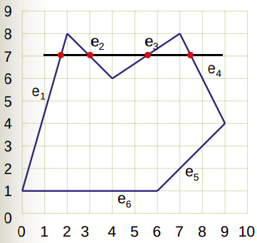
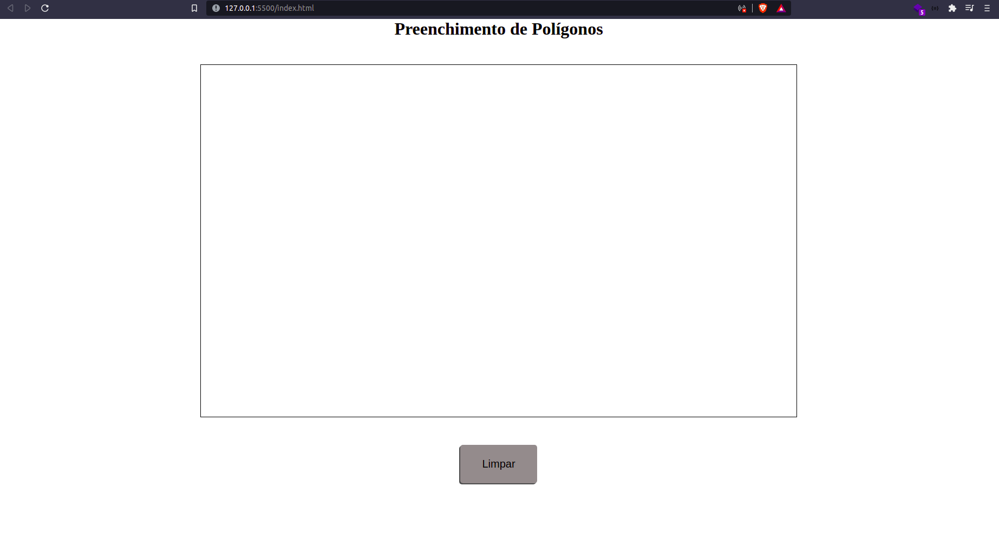
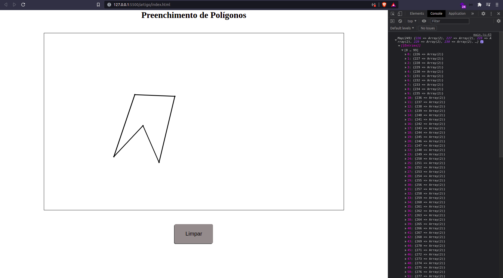

# Preenchimento de Polígonos

Por definição, um polígono é uma figura simples, plana e fechada, formada por um conjunto ordenado de três ou mais vértices, dispostos em um plano de tal modo que a junção de seus vértices formam segmentos de reta que não se cruzam, como mostrado na figura abaixo:

<div style="background-color: white; justify-content: space-around;  display: flex">
  
  
</div>

Um polígono pode ser preenchido, ou não e há diferentes algoritmos para preencher um polígono. Neste artigo implementaremos o algoritmo scanLine.

## Algoritmo ScanLine

O scanLine foi utilizado por Wylie, Romney, Evans e Erdahl no ano de 1967 e é explicado em [referencia](https://www.researchgate.net/publication/292183487_Scan-Line_Methods_for_Parallel_Rendering). A ideia básica deste algoritmo é mapear todos os pontos de interseção, no eixo das abcissas, para um determinado ponto no eixo das ordenadas. Esses pontos são parte das arestas do polígono. Assim, sabendo esses pontos, podemos preencher o espaço entre eles.

Utilizando o polígono da figura 2 como exemplo podemos pensar no seguinte:



imagem disponível em: [http://wiki.icmc.usp.br/images/7/7e/Scanline.pdf](http://wiki.icmc.usp.br/images/7/7e/Scanline.pdf)

Se no ponto de ordenada 7 traçarmos uma reta que cruza todo o polígono, podemos ver que há quatro arestas que interceptam essa reta, ou seja, para o ponto com _Y_ = 7 temos 4 pontos diferentes no eixo _X_ que marcam os limites do polígono. Se pudermos definir quais são esses pontos, podemos então preencher todos os pixels entre eles.

## Implementação

Para implementar esse algoritmo usaremos uma página html simples, que pode ser aberta em seu navegador, a linguagem de programação javascript e um editor de código de sua preferência. Além disso, para facilitar a interface com o **_canvas_**, utilizaremos a biblioteca P5.js ([https://p5js.org/](https://p5js.org/)). Como o foco deste artigo é a implementação do algoritmo _scanLine_ para preenchimento de polígonos, não entraremos em detalhes sobre a utilização, conceitos e paradigmas do **P5.js**, estruturas **html** ou do **css**. Sabendo disso, vamos iniciar ; ).

### Preparando o ambiente

Crie uma pasta para seu projeto e dentro dela crie um arquivo index.html, um arquivo styles.css e cole os seguintes códigos:

```html
<!-- index.html -->
<!DOCTYPE html>
<html lang="en">
  <head>
    <meta charset="UTF-8" />
    <meta http-equiv="X-UA-Compatible" content="IE=edge" />
    <meta name="viewport" content="width=device-width, initial-scale=1.0" />
    <script src="https://cdn.jsdelivr.net/npm/p5@1.4.0/lib/p5.js"></script>
    <link rel="stylesheet" href="./styles.css" />

    <title>Preenchimento de polígonos</title>
  </head>
  <body>
    <main>
      <h1>Preenchimento de Polígonos</h1>
      <section id="canvas"></section>
      <button onclick="clearCanvas()">Limpar</button>
    </main>
    <script src="./main.js"></script>
  </body>
</html>
```

```css
/*styles.css*/
* {
  margin: 0;
  border: 0;
  padding: 0;
  box-sizing: border-box;
}

body {
  width: 100vw;
}

main {
  display: flex;
  flex-direction: column;
  align-items: center;
}

canvas {
  outline: 1px solid black;
  margin: 3rem 0;
}

button {
  outline: none;
  background-color: #928c8c;
  padding: 1.5rem 2.5rem;
  border-radius: 5px;
  font-size: 20px;

  box-shadow: -2px 2px rgba(0, 0, 0, 0.7);
  transition: 0.2s;

  cursor: pointer;
}

button:hover {
  background-color: #666161;
}
```

Neste código temos a estrutura básica de um html com uma seção principal (main), um título, uma _section_ para o _canvas_ e um botão para limpar o _canvas_. No código css, há apenas alguns enfeites para que possamos identificar visualmente os componentes e ter uma melhor experiência durante o desenvolvimento.

No início do arquivo html você pode perceber a importação da biblioteca P5.js e ao final a do nosso arquivo javascript. Desse modo, crie um arquivo main.js e nele cole o seguinte código:

```js
// main.js
var canvas;

function setup() {
  canvas = createCanvas(1100, 650).parent("canvas");

  fill("#000000");
  stroke("#000000");
  strokeWeight(3);

  canvas.mousePressed(() => {
    const currentVertice = { x: Math.trunc(mouseX), y: Math.trunc(mouseY) };

    setVertice(currentVertice);
  });
}

function setVertice(currentVertice) {
  circle(currentVertice.x, currentVertice.y, 2);
}

function clearCanvas() {
  clear();
}
```

O que fazemos nessas funções iniciais é criar um canvas de 1100 unidades de largura por 650 unidades de altura, delegar as cores de preenchimento e das linhas, bem como sua espessura. Além disso temos uma função (_setVertice_) para que em cada click no canvas seja desenhado um ponto onde ocorreu o click - que futuramente será um dos vértices do nosso polígono. Por fim, há uma função para limpar todos os desenhos feitos no _canvas_, que é acionada pelo botão "Limpar". 

Para visualizar sua interface, você pode abrir o arquivo _index.html_ no navegador. Neste ponto sua interface deve ser similar à figura 3, onde pontos são desenhados a cada clique do mouse e limpos quando acionado o botão "Limpar".



## Estruturas Necessárias

Para que possamos executar o **_scanLine_** devemos ter alguns dados do polígono armazenados, sendo eles:

- Todos os vértices;
- O menor e maior _Y_;
- A lista de interseções para cada _Y_.

Cada vértice de um polígono pode ser representado por um objeto que armazena suas coordenadas x e y. Assim, para armazenar todos os vértices de um polígono, utilizaremos um vetor desses objetos.

O menor e o maior vértice do polígono pode ser representado por duas variáveis.

A lista de interseções pode ser representada por uma lista que tem a coordenada _Y_ como chave (ou cabeça) e um vetor de coordenadas _X_, que marcam os pontos de interseção. O javascript apresenta a estrutura [Map](https://developer.mozilla.org/en-US/docs/Web/JavaScript/Reference/Global_Objects/Map) para solucionar esse caso, evitando assim que tenhamos que implementar qualquer estrutura.

Assim, sabendo os dados que precisamos armazenar podemos criar um objeto _polygon_, conforme demonstrado abaixo, que deve ser declarado em escopo global e antes da função _setup_:

```js
const polygon = {
  vertices: [],
  minY: Number.POSITIVE_INFINITY,
  maxY: Number.NEGATIVE_INFINITY,
  intersections: new Map(),
};
```

O objeto _polygon_ representa um polígono genérico, onde a variável vertices é um vetor que irá armazenar todos os _n_ vértices do polígono, as variáveis minY e maxY irão armazenar o menor e maior _Y_ e a variável intersections irá armazenar as coordenadas _Y_ sendo as chaves e um vetor de coordenadas X, que são as interseções.

## Obtendo os Vértices

Os vértices do polígono são definidos com os cliques do usuário, ou seja, a cada clique um novo vértice é adicionado ao polígono. Para isso podemos utilizar a função **_setVertice_** já definida anteriormente. 

Para adicionar o vértice ao vetor de vértices basta executar o comando push, passando o _currentVertice_ que é recebido como parâmetro. Assim, ao final do polígono, teremos todos os vértices adicionados ao vetor, onde cada vértice é composto por um objeto contendo _x_ e _y_.

Para uma melhor experiência é interessante desenhar as arestas enquanto definimos os vértices, além do próprio vértice. Para isso, devemos utilizar a função _line_, ligando os vértices, tal como segue o código:

```js
function setVertice(currentVertice) {
  polygon.vertices.push(currentVertice);

  const lastIndex = polygon.vertices.length - 1;
  
  // Desenha o vértice
  circle(currentVertice.x, currentVertice.y, 2);

  // Desenha as arestas
  if (lastIndex > 0) {
    const lastVertice = polygon.vertices[lastIndex - 1];
    line(lastVertice.x, lastVertice.y, currentVertice.x, currentVertice.y);
  }
}
```

Nesse momento seu polígono está sendo desenhado com vértices e arestas. Entretanto, temos dois problemas:

1. A variável polygon.vertices não é limpa quando o _canvas_ é limpo; 
2. O polígono não fecha;

Começando pelo mais fácil: devemos limpar a variável _polygon.vertices_ toda vez em que o _canvas_ for limpo. Para isso, basta adicionar o código _polygon.vertices = []_ na função _clearCanvas_.

Para que possamos fechar o polígono a maneira mais fácil é escolher uma tecla (vamos utilizar a barra de espaço) que, quando pressionada, desenha a aresta entre o último e o primeiro vértice, fechando o polígono.

Utilizando a função _keyPressed_ do P5 podemos observar qual tecla foi pressionada, através da variável _keyCode_. Sabendo que o código para a barra de espaço é **32**, temos o seguinte procedimento para fechar o polígono:

```js
function keyPressed() {
  if (keyCode === 32) {
    const lastIndex = polygon.vertices.length - 1;
    const vertices = polygon.vertices;

    line(
      vertices[0].x,
      vertices[0].y,
      vertices[lastIndex].x,
      vertices[lastIndex].y,
    );
  }
}
```

Agora seu polígono pode ser completamente definido e fechado. Vale lembrar que a única parte desse código que é essencial para o _scanLine_ é o armazenamento dos vértices. Os demais processos ocorrem com o objetivo de tornar o processo visual mais agradável e semântico.

## ScanLine

Logo após fecharmos o polígono devemos realizar três passos:

1. Definir a menor e maior coordenada y;
2. Definir os pontos de interseção do polígono;
3. Ordenar e garantir que os pixels encontrados estão dentro do polígono;
4. Preencher o polígono;

### 1. Definir a menor e maior coordenada y

É necessário obter esses pontos para utilizá-los posteriormente no preenchimento e para definir as chaves do Map. A menor e maior coordenada _Y_ está em um dos vértices do polígono, portanto, basta percorrer o vetor de vértices e verificar qual dos pontos possui o maior e menor _Y_. 

Como ao criarmos o objeto polígono as variáveis minY e maxY receberam os valores **POSITIVE_INFINITY** e **NEGATIVE_INFINITY**, respectivamente, na primeira iteração ambas as variáveis recebem o mesmo valor, e com o decorrer das iterações, os valores são encontrados.

Para organizarmos o código, podemos criar uma função _defineIntersections_, que será responsável realizar os passos citados acima. Assim, a função se apresenta do seguinte modo:

```js
function defineIntersections() {
  // Define y máximo e mínimo
  polygon.vertices.forEach((vertice) => {
    if (polygon.maxY < vertice.y) polygon.maxY = vertice.y;
    if (polygon.minY > vertice.y) polygon.minY = vertice.y;
  });

  // Cria todas as posições dentro do Map com um vetor vazio
  for (let i = polygon.minY; i < polygon.maxY; i++)
    polygon.intersections.set(i, []);
}
```

Essa função deve ser chamada ao fecharmos o polígono, ou seja, no final do **_if_** da função _keyPressed_, conforme segue:

```js
function keyPressed() {
  if (keyCode === 32) {
    const lastIndex = polygon.vertices.length - 1;
    const vertices = polygon.vertices;

    line(
      vertices[0].x,
      vertices[0].y,
      vertices[lastIndex].x,
      vertices[lastIndex].y,
    );

    defineIntersections();
  }
}
```

### 2. Definindo os pontos de interseção do polígono;

Para definir as interseções devemos calcular os todos os pontos _x_ em uma determinada aresta AB. Esses pontos são obtidos através de um método incremental, onde inicia-se com o _x_ do ponto com menor _y_ e pode-se somar o _x_ anterior à constante 1/_coeficiente_angular_, obtendo-se assim o _x_ da iteração atual.

O valor 1/_coeficiente_angular_ pode ser interpretado como a razão de variação em _x_ para uma unidade variada em _y_.

Para definir os pontos em todos os vértices do polígono podemos percorrê-los, em sequência, chamando a função _defineEdge_ e nessa, faremos as operações necessárias para obter os valores de interseção nesta aresta.

```js
function defineIntersections() {
const verticesSize = polygon.vertices.length;

  // Define y máximo e mínimo
  polygon.vertices.forEach((vertice) => {
    if (polygon.maxY < vertice.y) polygon.maxY = vertice.y;
    if (polygon.minY > vertice.y) polygon.minY = vertice.y;
  });

  // Cria todas as posições dentro do Map
  for (let i = polygon.minY; i < polygon.maxY; i++)
    polygon.intersections.set(i, []);

  for (let i = 0; i < verticesSize; i++)
    defineEdge(polygon.vertices[i], polygon.vertices[(i + 1) % verticesSize]);
}
```

A função _defineEdge_ pode ser feita do seguinte modo:


```js
function defineEdge(vertice1, vertice2) {
  if (vertice1.y != vertice2.y) {
    const intersections = polygon.intersections;
    let initialY, endY;
    let currentX;

    const variation = (vertice2.x - vertice1.x) / (vertice2.y - vertice1.y);

    if (vertice1.y < vertice2.y) {
      initialY = vertice1.y;
      endY = vertice2.y;
      currentX = vertice1.x;
    } else {
      initialY = vertice2.y;
      endY = vertice1.y;
      currentX = vertice2.x;
    }

    for (let currentY = initialY; currentY < endY; currentY++) {
      intersections.get(currentY).push(currentX);
      currentX += variation;
    }
  }
}
```

Só é necessário descobrir os pontos de interseção de uma aresta se a mesma não for horizontal. Assim, precisamos definir o ponto _Y_ inicial para o laço de repetição, a variação em _X_ para cada _Y_ percorrido e o ponto _Y_ de parada do laço.

A variação pode ser descoberta pelo inverso do coeficiente angular da reta, ou seja, por (vertice2.x - vertice1.x) / (vertice2.y - vertice1.y). Além disso, sempre percorremos a aresta do ponto com menor _Y_ para o ponto com maior _Y_. 

Ao percorrer a aresta devemos apenas adicionar o ponto _x_ descoberto ao final do vetor daquela chave.

Após definir todos os pontos de interseção do polígono, você pode adicionar _console.log(polygon.intersections)_ ao final da função _defineIntersections_, ir até seu navegador e abrir as ferramentas de desenvolvedor (Figura 4). Ao desenhar um polígono, ele mostrará todas as chaves com seus respectivos vetores com os _X_ que são interseções daquele determinado ponto _Y_ (Figura 5);


Figura 4: Demonstração de ferramentas de desenvolvedor

Figura 5: Demonstração do _console.log_ da variável _polygon.intersections_ de um determinado polígono.


### 3. Ordenar e garantir que os pixels encontrados estão dentro do polígono;

Como você pode ter percebido no _console.log_ que fizemos, alguns vetores estão desordenados. Entretanto, para preenchermos o polígono, eles devem estar ordenados. Para isso, adicionamos o seguinte código ao final da função _defineIntersections_:

```js
polygon.intersections.forEach((xArray) => xArray.sort((a, b) => a - b));
```

Esse código percorre todas as listas e ordena os vetores dessas do menor para o maior valor.

Ao calcularmos os pontos de interseção, eles estão exatamente sobre a aresta, porém, devemos preencher apenas o interior do polígono. Assim, para garantirmos que todos os pontos estão dentro do polígono, devemos aproximar as coordenadas _X_ a um valor inteiro. 

Entretanto, não podemos aproximar os os pixels das arestas que estão à esquerda para baixo, pois assim não estariam mais dentro do polígono. O mesmo se aplica às coordenadas das arestas à direita do polígono. Caso essas sejam aproximadas para cima, elas estarão fora do polígono definido.

Felizmente, sabendo que cada lista da nossa variável _intersections_ está ordenada do menor para o maior, sabemos que todo valor com índice par (0, 2, 4, ..., 2n) pertence a uma aresta da esquerda do polígono, ou seja, deve ser arredondada para cima. Analogamente, sabemos que todos os valores com índice ímpar (1, 3, 5, ..., 2n-1) pertencem a uma aresta à direita do polígono, ou seja, devem ser arredondadas para baixo.

Sabendo disso, podemos utilizar a mesma função _forEach_ que utilizamos para ordenar o vetor, para fazer os arredondamentos, evitando assim ter que percorrer todas as listas novamente:

```js
polygon.intersections.forEach((xArray) => {
  xArray.sort((a, b) => a - b);

  const arraySize = xArray.length;

  for (let i = 0; i < arraySize; i++) {
    if (i % 2 === 0) xArray[i] = Math.ceil(xArray[i]);
    else xArray[i] = Math.floor(xArray[i]);
  }
});
```

### 4. Preencher o polígono

Chegamos aos finalmentes, entretanto, antes de implementarmos o preenchimento, devemos também _resetar_ as variáveis _intersections_, _minY_ e _maxY_ do polígono, para que estas não interfiram em outros polígonos após a limpeza do canvas. Para isso, adicione o seguinte código na função _clearCanvas_:

```js
function clearCanvas() {
  polygon.vertices = [];
  polygon.intersections = new Map();
  polygon.minY = Number.POSITIVE_INFINITY;
  polygon.maxY = Number.NEGATIVE_INFINITY;

  clear();
}
```

Agora com tudo certo e definido podemos efetivamente preencher o polígono!

O preenchimento do polígono é feito de cima para baixo (do menor para o maior _Y_), onde para cada _Y_, utilizamos o vetor de coordenadas _X_ - armazenados em _intersections_. Vamos pegar as coordenadas _X_ duas a duas nesse vetor, pois essas formam o intervalo de preenchimento entre duas arestas, e preencher com pontos, conforme segue:

```js
function fillPolygon() {
  const initialY = polygon.minY;
  const endY = polygon.maxY;
  const intersections = polygon.intersections;

  for (let currentY = initialY; currentY < endY; currentY++) {
    const currentPoint = intersections.get(currentY);
    let k = 0;

    do {
      let firstX = currentPoint[k];
      let endX = currentPoint[k + 1];

      for (let currentX = firstX; currentX < endX; currentX++)
        point(currentX, currentY);

      k += 2;
    } while (currentPoint[k]);
  }
}
```
Antes de finalizarmos, você deve chamar a função _fillPolygon_ ao final da função _defineIntersections_. Ao fazer isso, os polígonos de qualquer complexidade ou quantidade de lados será preenchido em sua página html:


## Conclusão

Neste artigo foram apresentados os princípios do algoritmo _scanLine_ e um modo de implementá-lo com javascript. Sabendo esses conceitos é possível implementá-lo em qualquer linguagem com suporte para ferramentas visuais e de desenho.
Entretanto, como o foco do artigo foi demonstrar os passos para o preenchimento do polígono pelo método _scanLine_, alguns erros não foram tratados, como por exemplo fechar um polígono com menos de três vértices ou poder definir mais vértices após o fechamento do mesmo. 
Ainda como sugestão de melhoria, você pode implementar esses algoritmos com orientação a objeto e torná-los método de uma classe _Polygon_. As possibilidades são inúmeras.

O código fonte para a aplicação pode ser encontrado no [github](https://github.com/Matozinho/ICVs/tree/master/Computacao%20Grafica/ConversaoMatricial/Recortes%20e%20Preenchimento%20de%20Poligonos/artigo/application).
Este artigo é parte do projeto de iniciação científica da Universidade Estadual do Oeste do Paraná (Unioeste), sob financiamento do MEC através do [PETComp](https://petsite-bd39a.web.app/) e orientação do docente Adair Santa Catarina.