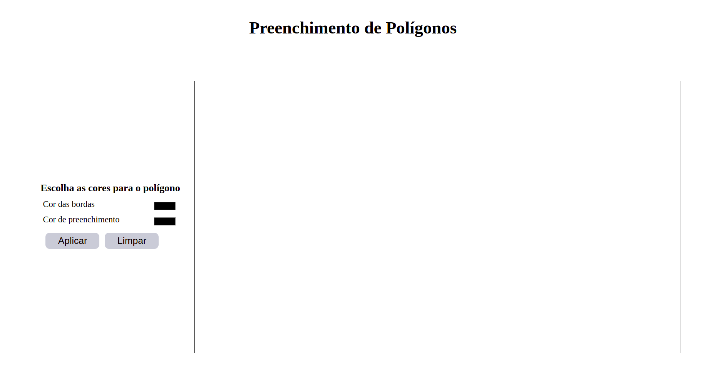

<header>
  
  
</header>

   
 
 

 
# Preenchimento de Polígonos

  
Esta aplicação foi desenvolvida durante a Inciação Científica do ano de 2020/2021, através do grupo [PETComp](https://petsite-bd39a.web.app/), sob financiamento do MEC, com o intuito de demonstrar o algoritmo de preenchimento de polígonos a disciplina de Computação Gráfica da Universidade Estadual do Oeste do Paraná, sob orientação do docente Adair Santa Catarina.

## Como Utilizar

Na interface é possível definir pontos clicando com o botão esquerdo do _mouse_ dentro da área delimitada pela borda preta. Cada ponto é definido como um vértice.

  

Com o botão direito do mouse, a tecla espaço ou a tecla enter é possível fechar o polígono. Logo que fechado, é executado o algoritmo de preenchimento.

Na região de troca de cores é possível escolher as cores das bordas do polígono bem como a cor do preenchimento. Toda vez que uma alteração for feita nas cores é necessário clicar no botão "Aplicar".

Quando desejar desenhar outro polígono, ou mesmo reiniciar o processo sem fechar um polígono, basta clicar no botão "Limpar".

A aplicação **NÃO** é responsiva e se adapta a monitores de resolução superior a 1440 x 900.
## Especificações técnicas

A aplicação foi desenvolvida utilizando a biblioteca [React](https://pt-br.reactjs.org/), a partir do [create react app](https://github.com/facebook/create-react-app), em ambiente linux (ubuntu 20.04). A biblioteca React permite a componentização de elementos da interface, além da utilização do [ES6](https://262.ecma-international.org/6.0/), para uma melhor organização de código. Para facilitar a interação com o _canvas_, utilizou-se a biblioteca [P5.js](https://p5js.org/).

Além disso, visando uma melhor escalabilidade, compreensão e propiciar um desenvolvimento colaborativo, optou-se por utilizar o _superset_ [Typescript](https://www.typescriptlang.org/), pois esse adiciona tipagem à linguagem e, que juntamente com [linters](https://sourcelevel.io/blog/what-is-a-linter-and-why-your-team-should-use-it) facilitam o desenvolvimento.

## Replicar localmente

Para rodar o projeto em sua máquina e realizar alterações, basta clonar o repositório:

`$ git clone https://github.com/Matozinho/ICVs.git`

Ir até o diretório da aplicação e executar o comando para instalar as dependências do projeto.

`$ yarn`

Assim, para rodá-lo no servidor local, execute o comando:

`$ yarn start`

Pronto, o projeto estará em http://localhost:3000/
